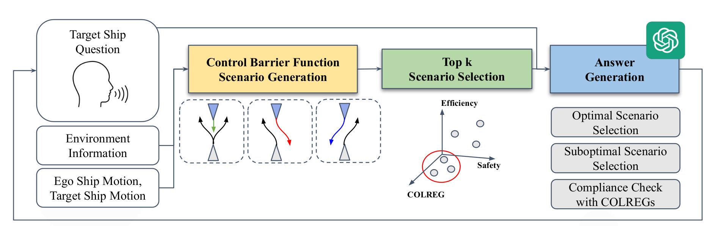

# MARQA 🚢 : Bridging Human and Autonomous Ship Operations Through Large Language Model-Based Navigational Reasoning (T-ITS Review)
[](https://yeongha-shin.github.io/MARQA/)

## 🔍 Framework Overview


**MARQA**: This study develops MARQA (Maritime Autonomous Reasoning for Question Answering), an algorithm utilizing large language models (LLMs) to enable navigational question-and-answer interactions between vessels.

## 🌟 Highlights
- **`2025-03-31`** Our paper has been submitted to the T-ITS journal and is currently under review.
  
## 📩 Getting Started

## 🎯 MARQA-Benchmark
We propose `MARQA-Benchmark', the first benchmark for question-and-answer algorithms used in ship navigation. It includes over 8,000 human-validated question-and-answer pairs based on COLREG encounter situations. We made diverse combinations for the five types of COLREG encounter situations. Dataset will be generated for encounters involving a single ship as well as situations where two ships meet.

## 📝 Citation
```
@article{Shin2025MARQA,
  title={MARQA: Bridging Human and Autonomous Ship Operations Through Large Language Model-Based Navigational Reasoning},
  author={Shin, Yeongha and Lee, Changyu and Kim, Jinwhan},
  journal={}, 
  year={2025},
}
```

## ✅ License
